# Desert Habitat
Software for the desert habitat IoT devices and monitoring.

* [Summary](#summary)
* [Structural Features](#structural-features)
  * [Planning](#planning)
  * [Exterior](#exterior)
  * [Interior](#interior)
* [Technical Features](#technical-features)
* [Technical Documentation](#technical-documentation)
* [Requirements](#requirements)

FINISHED PHOTO HERE

## Summary
The desert habitat is a large-sized habitat housing a young bearded dragon, intended to serve as an enclosure for the duration of the dragon's long life. It contains a water feature allowing the dragon to drink from a very shallow pool or to lick the rocks for water when needed.  It contains one heat pad hidden under the substrate, two daytime heat lamps, one night time heat lamp, and two UVA/UVB lamps for the daytime.

Sensors in the habitat include temperature and humidity for the top right corner ("Basking"), and the lower left corner ("Cooling") as well as a water-level sensor.

These sensors are polled by a raspberry pi and upload data to Amazon Timestream. They are graphed by Grafana for AWS, accessible anywhere in the world with an internet connection. IFTTT provides push notifications if the sensors report abnormal values for an extended period.

## Structural Features
The physical features of the habitat are detailed below.

### Planning

The project began by first identifying a place in the house for the habitat. A suitable wall was found, far from windows so that the sun's rays wouldn't disturb the temperature regulation of the habitat, and close to where we spend time during the day, for maximal interaction. The dimentions that fit optimally were 48 inches by 44 inches.

I began drawing the enclosure, keeping several points in mind while doodling:
- The habitat needed to be cat proof.
- The floor level of the habitat needed to be high enough for a human to clean, or handle and feed the dragon.
- Storage would be ideal, for things like food and supplies.
- A ramp or stairs would be required, allowing the reptile to move about, thus regulating its body temperature.
- Water needed to be present, but not deep.
- A bearded dragon does not naturally encounter standing water, notices running water more easily, and prefers to lick rocks for moisture intake.
- Live plants would help the ambiance.
- Dragons like climbing branches, as their natural habitat is desert woodland, and they often sleep in trees.
- A cooling corner is required, with a cave or hiding place, away from the heat lamps.

Given these requirements, my designs included plans for structural elements as well as artistic choices. For instance, I settled on trying to recreate diagonal strata in the rock wall, lifting as a result of geologic activity, with flat desert rocks. I designed a natural cave, a rock cradling a shallow water pool, the placement of two plants.

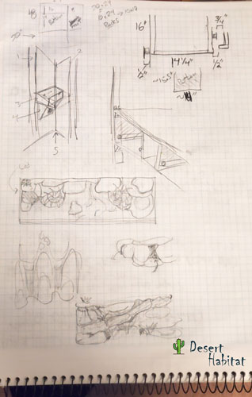

### Exterior

Built from pine, due to cost, a mix of rough pine was used for the back, bottom, and generally for portions that won't be seen. Fine sanded pine was used for the main structure (the supports, the siding, the top, the drawers).  Plexiglass (clear acrylic) was used for the transparent sliding doors in front and on the side.  The top is made from an office light egg crate louver which proved _not_ to be cricket-proof (something that I wish had occurred to me much earlier) and is now therefore covered by fiberglass screen mesh.

### Interior

The interior began as styrofoam blocks both purchased from Michael's art store as well as salvaged from the garbage. These were held together with toothpicks. In retrospect, a glue should have been used to further secure them. The foam was shaped primarily by a heated foam cutter purchased from Michaels. The required features were worked in at this time, including places for two live plants, rocks for water to trickle down into a pool, a natural looking rock cave, a basking rock, and a ramp leading to the cooling corner.

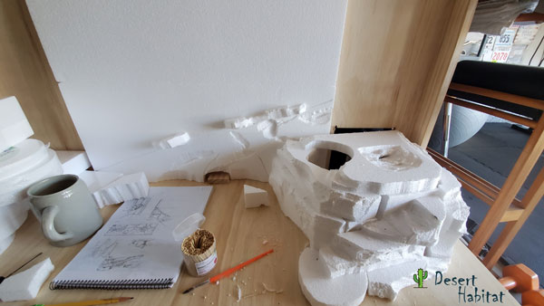  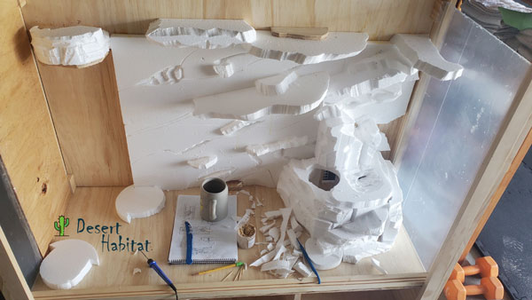

The foam was then covered in a thick sanded grout mix, Charcoal Black in color. This was applied by hand, later with latex gloves (another late discovery - grout severly dries out one's skin).

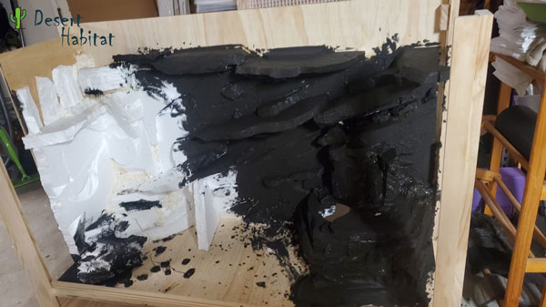  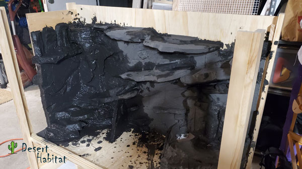

Once dry, the entirety of the habitat was then covered in another layer of grout, Navajo White in color.

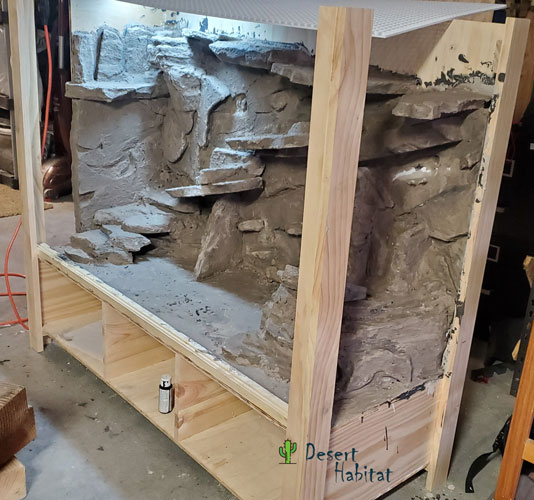

During this process, I began purchasing items that I knew I would need, including heat lamps and substrate. The substrate is a sand from Australia that is orange and red in color. I attempted to match this color as best as I could using acrylic paints that I applied with a generous amount of water as a "wash" over the grout. I intended to keep the saturation relatively low.

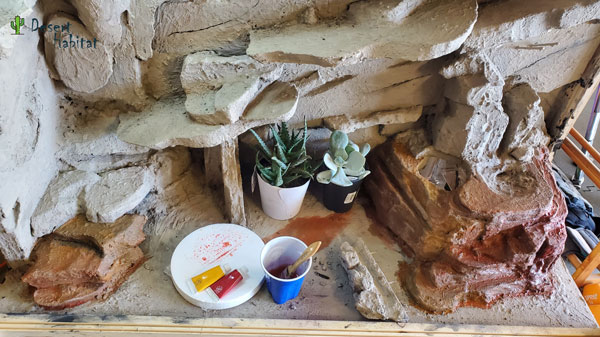

I mixed enough paint for about a square foot or two of the rocks at a time, and my pigment mixture varied from batch to batch, sometimes more red, sometimes more orage. I made sure to paint rocks diagonally along the back wall so that the pigment formed strata. The paint lightened as it dried, and I got a bit more aggressive with the amount of pigment that I used.

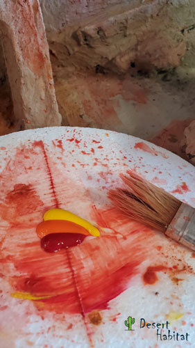

To my chagrin, I was overly ambitious with the pigment, and many of my rocks were quite saturated, even after drying.  While I was dismayed, this proved to be a happy accident, as it actually looks pretty good in the end.

I mixed black acrylic paint into a spray bottle and sprayed the walls, allowing the black to run into creases, and blotting off some black where it was too strong. I then followed up with a brush, applying black to areas that needed to feel deeper or darker.  Finally, after sanding any grout that mistakenly reached the back wall, I applied a white wash to the walls above the rock in anticipation of a skyline.

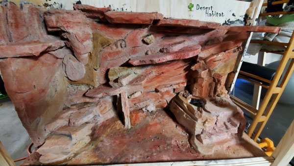

Since I was including a water feature, I wanted to ensure that the rock where the water would be running would resist many hours of water, and would be as waterproof as possible. To this end, I mixed some epoxy and applied it with a strip of cardboard to where the water was meant to run. I ran into an issue here. I had carved channels for the water to naturally run through, carried by gravity, but what I didn't anticipate is that the epoxy is subject to the same gravity, so as it was curing, it would run down into those channels, filling them in. As a result, my water is much less directed than was intended. I have not found a fantastic solution to this so far except for applying epoxy over a larger area or directing the water with the inclusion of more rocks.

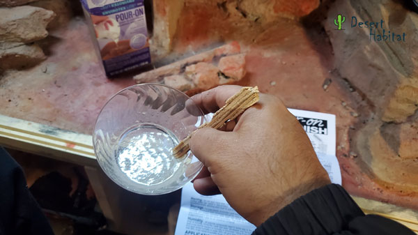

The next step was to paint the sky. I used reference photos of Utah for this, noting that the clouds in the photos hugged the horizon. I applied a progressively lighter shade of blue from the top down and let that dry. I then circled back in for some darker cloud colors (a grey), and then pure white which I applied as the grey was still drying. This allowed me to blend it well into the darker clouds. After a few minutes, I went back in with pure white again and painted the highlights.

After the sky and clouds had been painted, I began painting the mountain and rock features in the distance. I used the same colors as were used for the rock, but mixed blue and white into them to give them the appearance of distance. I applied a base color to get the shapes, then went in with shade first, then the base color (blending that into the shadows, as needed) and finally highlight colors which skewed towards a more yellow/orange color. I tried to follow the contours of the habitat to some degree, lending to a sense of forced perspective.

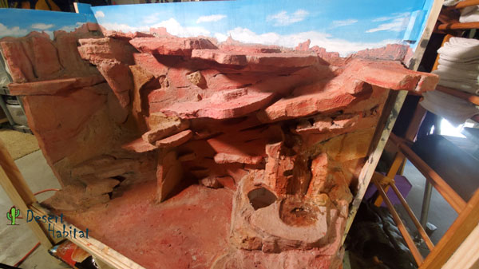

The final paint application was to paint the wood of the structure semi-gloss white. This blends into the furniture that we have already in the room where the habitat will sit.

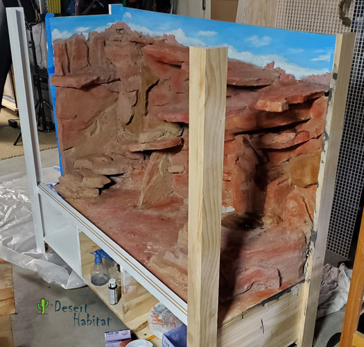

To accommodate the plants, I needed a pot that would be waterproof, and that would fit in the non-standard openings that I had cut for the plants. My solution here was to use Super Sculpy and aluminum foil to shape a container specificaly to fit. This was baked and painted to blend in. Finally, soil and desert plants were added. One aloe vera cactus occupies the bottom of the habitat, and one succulent (possibly crassula) occupies the top.

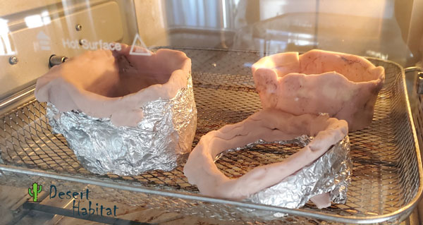  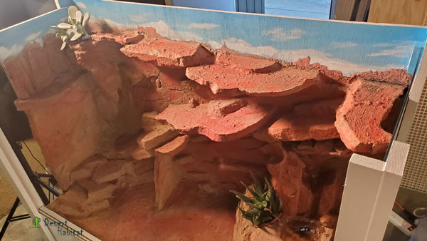

Plexiglass (which was cut to fit early on) was then put into place and the top of the enclosure was finished. The Australian sand substrate was added along with a branch that had an interesting shape and a couple of twigs. Rocks from the craft store were added, the heat lamps were put in place, and the electronics were installed (see Technical Features).

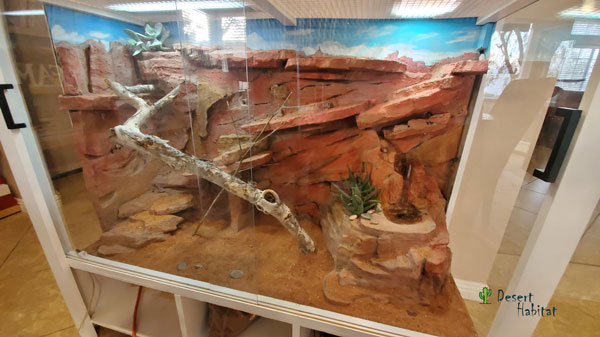

It was now ready for a delightful occupant: one bearded dragon!

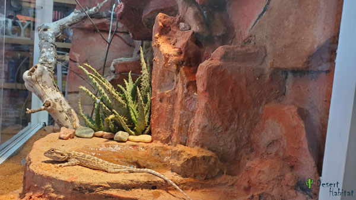

## Technical Features

## Technical Documentation

### Requirements
