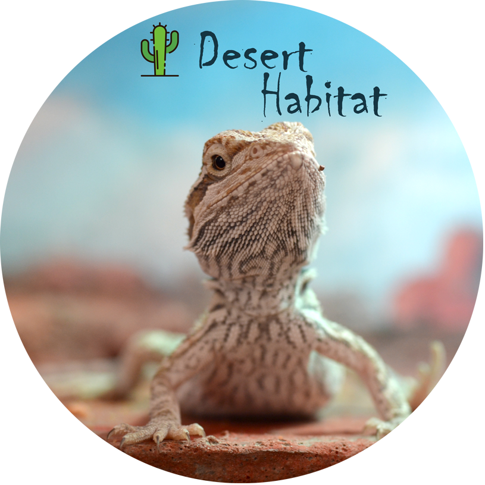

# desert_habitat
Software for the desert habitat IoT devices and monitoring.

* [Summary](#summary)

## Summary
The desert habitat is a large-sized habitat housing a young bearded dragon, intended to serve as an enclosure for the duration of the dragon's long life. It contains a water feature allowing the dragon to drink from a very shallow pool or to lick the rocks for water when needed.  It contains one heat pad hidden under the substrate, two daytime heat lamps, one night time heat lamp, and two UVA/UVB lamps for the daytime.

Sensors in the habitat include temperature and humidity for the top right corner ("Basking"), and the lower left corner ("Cooling") as well as a water-level sensor.

These sensors are polled by a raspberry pi and upload data to Amazon Timestream. They are graphed by Grafana for AWS, accessible anywhere in the world with an internet connection. IFTTT provides push notifications if the sensors report abnormal values for an extended period.

